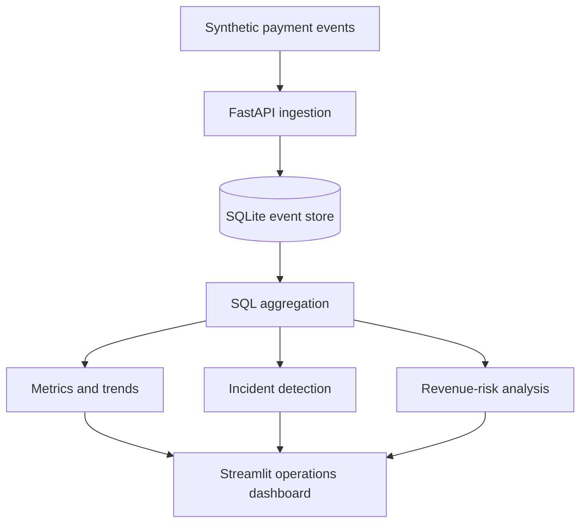

<div align="center">

# 💳 PayWatch

### When payments fail, every second costs revenue.

A payment-operations observability platform that transforms raw transaction events into processor insights, latency trends, revenue-risk estimates, and actionable incident alerts.


[Features](#key-features) · [Architecture](#architecture) · [API](#api-endpoints) · [Run Locally](#local-setup)

</div>

---

## The Problem

A merchant reports that customers cannot complete payments.

Where is the failure coming from?

- A merchant’s POS terminal?
- A specific payment processor?
- Increasing authorization latency?
- A sudden spike in declines?
- A wider payment-processing outage?

Without transaction-level observability, payment operations teams may spend valuable time searching through logs while merchants continue losing revenue.

**PayWatch is designed to shorten that investigation.**

It collects payment events, calculates operational metrics, compares processor performance, detects unhealthy conditions, estimates revenue at risk, and presents the results through an interactive dashboard.

> PayWatch does not process real payments. It simulates the monitoring and incident-response layer surrounding payment infrastructure.

## Key Features

### Real-time payment monitoring

Track payment attempts and their outcomes:

- Approved transactions
- Declined transactions
- Processing errors
- Payment volume
- Average and maximum latency

### Processor performance analysis

Compare payment processors using:

- Approval rate
- Decline rate
- Error rate
- Transaction count
- Average response time
- Maximum response time

### Automated incident detection

PayWatch evaluates recent processor metrics and creates an incident when operational thresholds are exceeded.

The current rule marks a processor as critical when:

```text
processor error rate > 5%
```

Each incident includes:

- Affected processor
- Severity
- Triggering metric
- Current value
- Configured threshold
- Human-readable explanation

### Revenue-risk estimation

Estimate the value of unsuccessful payments during a selected monitoring period.

This helps translate a technical failure into a business question:

> How much payment volume may have been affected?

### Time-based monitoring

Analyze payment activity across:

- Today
- Yesterday
- Last 7 days
- All time

### Transaction trends

View transaction activity over time, including:

- Payment attempts
- Payment outcomes
- Payment volume
- Latency changes

### Terminal-level visibility

Investigate recent performance by:

- Merchant
- Terminal
- Processor

This helps determine whether an issue is isolated to one POS terminal or affects a larger part of the payment system.

### Synthetic event generation

Generate realistic test traffic without using real customer or card information.

The generator creates:

- A random number of transactions per run
- Multiple merchants and terminals
- Multiple payment processors
- Approved, declined, and error outcomes
- Realistic response codes
- Higher latency for processing errors

## What PayWatch Answers

| Operational question | PayWatch signal |
|---|---|
| Are payments succeeding? | Approval, decline, and error rates |
| Which processor is unhealthy? | Processor-level metrics |
| Are payments slowing down? | Average and maximum latency |
| Is the problem happening now? | Time-based monitoring windows |
| Which terminals are affected? | Terminal-level metrics |
| How much revenue may be affected? | Revenue-risk estimation |
| Does the issue require attention? | Automated incident detection |

## Architecture



## Data Flow

1. The synthetic generator creates a payment event.
2. The event is sent to the FastAPI application.
3. Pydantic validates the event structure.
4. The event is stored in SQLite.
5. SQL queries aggregate transaction metrics.
6. The incident service evaluates operational thresholds.
7. The dashboard retrieves insights through API endpoints.
8. Payment operators can investigate processors, terminals, latency, and revenue risk.

## Project Structure

```text
paywatch-payment-monitor/
├── app/
│   ├── __init__.py
│   ├── database.py
│   ├── incident_service.py
│   ├── main.py
│   └── models.py
├── dashboard/
│   └── app.py
├── generate_events.py
├── requirements.txt
├── .gitignore
└── README.md
```

## Technology Stack

| Layer | Technology |
|---|---|
| API | FastAPI |
| Validation | Pydantic |
| Database | SQLite |
| Analytics | SQL and Pandas |
| Dashboard | Streamlit |
| HTTP client | Requests |
| Application server | Uvicorn |
| Test data | Python synthetic event generator |

## API Endpoints

| Method | Endpoint | Purpose |
|---|---|---|
| `GET` | `/health` | Check whether the API is running |
| `POST` | `/events` | Ingest a payment event |
| `GET` | `/events` | Retrieve stored payment events |
| `GET` | `/metrics` | Return aggregated payment metrics |
| `GET` | `/metrics/trends` | Return time-based transaction trends |
| `GET` | `/metrics/processors` | Compare processor performance |
| `GET` | `/metrics/terminals` | Analyze recent terminal performance |
| `GET` | `/metrics/revenue-risk` | Estimate unsuccessful payment value |
| `GET` | `/incidents` | Return active payment incidents |

### Supported periods

Endpoints that accept a `period` parameter support:

```text
today
yesterday
7_days
all_time
```

Example:

```text
GET /metrics?period=7_days
```

Interactive API documentation is available at:

```text
http://127.0.0.1:8000/docs
```

## Example Payment Event

```json
{
  "merchant_id": "merchant-001",
  "terminal_id": "terminal-003",
  "processor": "processor-b",
  "amount": 124.75,
  "currency": "USD",
  "status": "approved",
  "response_code": "00",
  "latency_ms": 238
}
```

## Local Setup

### 1. Clone the repository

```bash
git clone https://github.com/Prahal007/paywatch-payment-monitor.git
cd paywatch-payment-monitor
```

### 2. Create a virtual environment

```bash
python3 -m venv .venv
source .venv/bin/activate
```

On Windows:

```bash
.venv\Scripts\activate
```

### 3. Install dependencies

```bash
pip install -r requirements.txt
```

### 4. Start the API

```bash
python -m uvicorn app.main:app --reload
```

Confirm the API is healthy:

```bash
curl http://127.0.0.1:8000/health
```

Expected response:

```json
{
  "status": "healthy"
}
```

### 5. Generate payment events

Open another terminal, activate the virtual environment, and run:

```bash
python generate_events.py
```

The generator randomly creates between 10 and 300 payment events per run.

### 6. Start the dashboard

Open another terminal and run:

```bash
streamlit run dashboard/app.py
```

Open the dashboard at:

```text
http://localhost:8501
```

## Example Investigation

Suppose `processor-b` reports:

```text
error rate: 8.38%
configured threshold: 5%
```

PayWatch creates a critical incident because the processor error rate exceeds the configured threshold.

An operations analyst can then:

1. Compare `processor-b` with the other processors.
2. Review its latency and payment outcomes.
3. Identify affected merchants and terminals.
4. Estimate the payment volume at risk.
5. Decide whether traffic should be investigated or rerouted.

## Data and Privacy

PayWatch uses synthetic payment data.

It does not store:

- Card numbers
- Bank account numbers
- Routing numbers
- Customer credentials
- Personally identifiable information

The local SQLite database is excluded from Git because it contains generated runtime data and is recreated when the application runs.

## Skills Demonstrated

This project demonstrates:

- Python application development
- REST API design
- SQL aggregation and filtering
- Data validation
- ETL-style data processing
- Time-window analysis
- Operational metrics
- Incident detection
- Revenue-impact analysis
- Pandas transformations
- Streamlit dashboard development
- Fintech and payment-domain understanding

## Current Limitations

PayWatch is a portfolio prototype and currently:

- Uses synthetic payment events
- Stores data locally in SQLite
- Uses rule-based incident detection
- Runs as a local application
- Does not connect to real payment processors
- Does not automatically reroute payment traffic

## Roadmap

Planned improvements include:

- PostgreSQL support
- Merchant-specific alert thresholds
- Processor health scoring
- Response-code analysis
- Automated traffic-routing simulations
- Webhook, Slack, or email alerts
- Fraud and anomaly-detection experiments
- Docker-based deployment
- Automated API tests
- Cloud deployment
- Historical incident tracking
- Chaos-testing scenarios for processor failures

## Why I Built This

PayWatch combines my interests in:

- Payments
- Merchant operations
- POS systems
- Data engineering
- API development
- Operational analytics
- Fintech reliability

The goal is to demonstrate how raw payment data can be transformed into operational decisions—not just displayed in a dashboard.

## Author

Built by [Prahal](https://github.com/Prahal007).

If this project interests you, feel free to open an issue, suggest an improvement, or connect with me to discuss payments and fintech engineering.